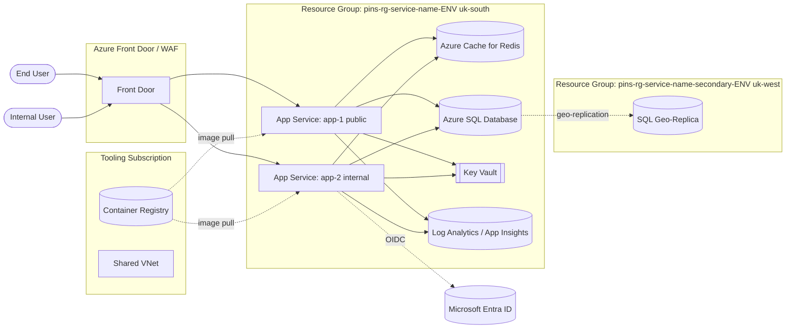
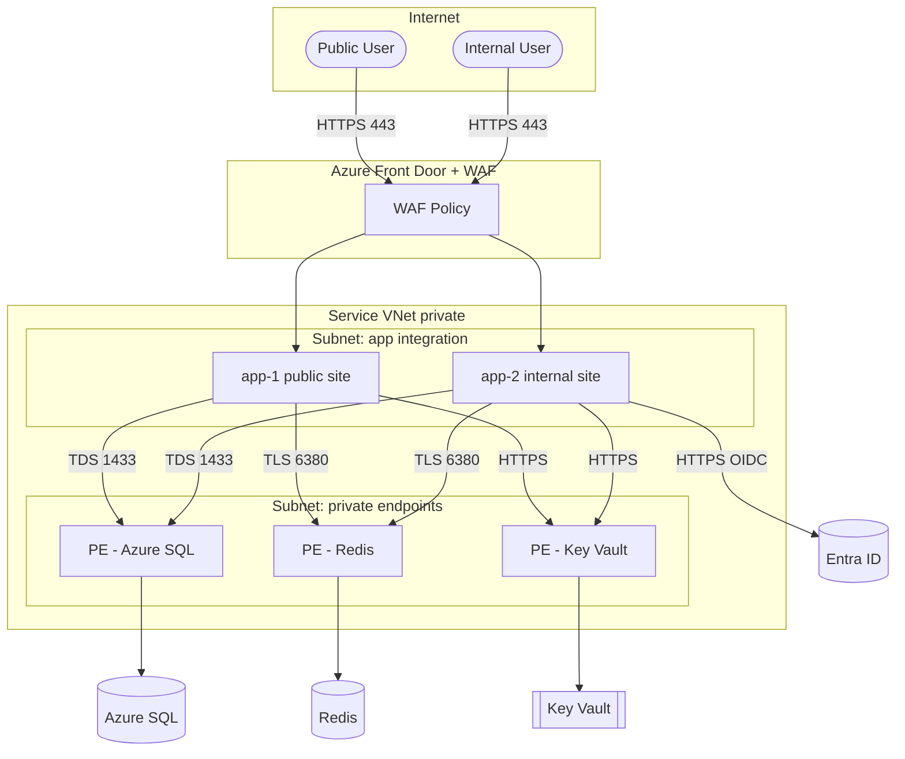
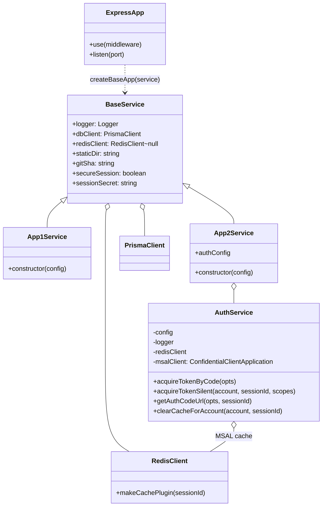
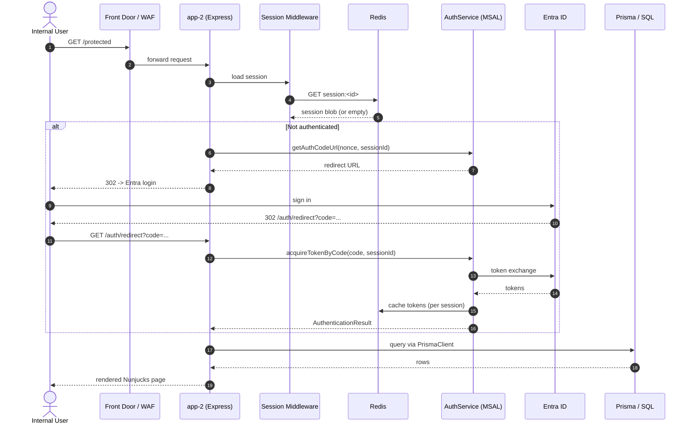
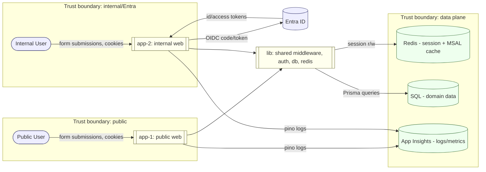
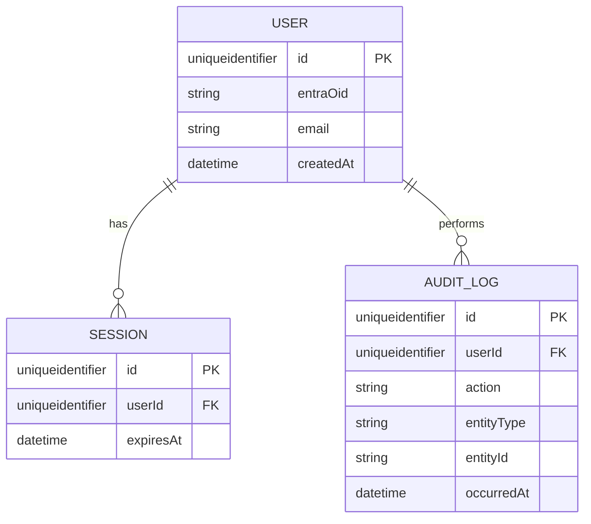
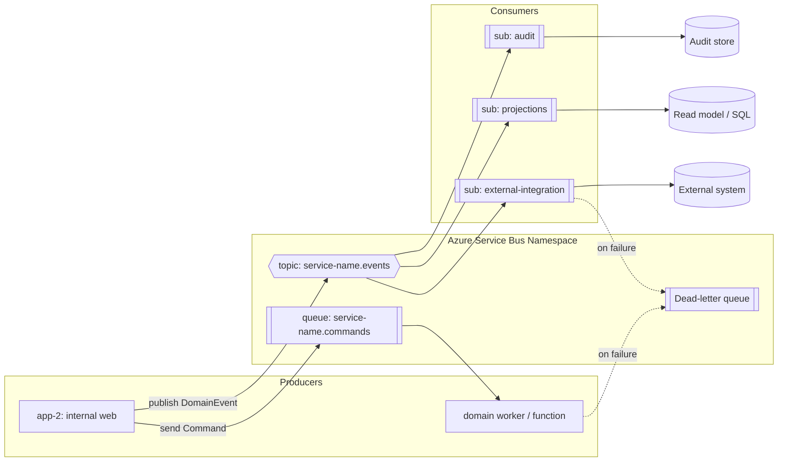
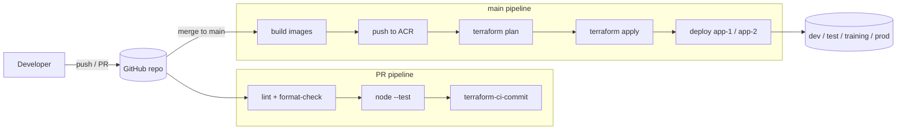

# Template Service

A template repository for creating new services. This repository includes a basic structure and configuration files covering the common aspects of a service. This includes setup such as:

- ESlint
- Commitlint
- Prettier
- Husky
- Docker
- Prisma

Generally this repo can be copied/cloned for a new project, and a few find+replace runs will get things started:

* Replace 'service-name' with the new service name in the codebase.
* Replace `app-1` with the app name, e.g. `api`
* Replace `app-2` with the app name, e.g. `web`

App 1 is given in the PINS/Public style, App 2 is given in the back office/internal style, with Entra Auth.

## Architecture Diagrams

The following Mermaid diagrams describe the moving parts of a service produced from this template. Replace `service-name`, `app-1` and `app-2` with the real names once the template has been instantiated.

> Note: the database schema (see [packages/database/src/schema.prisma](packages/database/src/schema.prisma)) is intentionally empty in the template, and there is no Azure Service Bus integration in the codebase today. The ER and Service Bus diagrams below show the recommended/expected shape for new services and should be tailored once domain models and event flows are added.

### Resource / Deployment Diagram

High-level Azure topology that a service built from this template is expected to deploy into. The Terraform in [infrastructure/](infrastructure/) currently only provisions the resource groups ([infrastructure/main.tf](infrastructure/main.tf)) — additional resources are layered in per environment.

### Networking Diagram

Network/trust boundaries and inbound/outbound traffic.

### Component / Service UML

Class-style view of the runtime composition shared by both apps via [packages/lib](packages/lib/). `BaseService` ([packages/lib/app/base-service.js](packages/lib/app/base-service.js)) owns the cross-cutting clients; each app extends it.

### Request / Auth Sequence (App 2)

End-to-end flow for an authenticated request through `app-2`, exercising session, MSAL and the data layer. See [apps/app-2/src/app/auth/router.js](apps/app-2/src/app/auth/router.js) and [apps/app-2/src/app/auth/auth-service.js](apps/app-2/src/app/auth/auth-service.js).

### Data Flow Diagram (DFD)

Logical data movement, classification and trust boundaries.

### Entity Relationship Diagram (template)

The Prisma schema in [packages/database/src/schema.prisma](packages/database/src/schema.prisma) is currently empty. The diagram below is an illustrative starting point — replace with the real domain when models are added.

### Service Bus Event Flow (recommended pattern)

Not implemented in the template today. Shown here as the recommended pattern when asynchronous integrations are added (e.g. via `@azure/service-bus`).

### CI/CD Pipeline Flow

Mirrors the pipelines under [infrastructure/pipelines/](infrastructure/pipelines/) and the application Dockerfiles ([apps/app-1/Dockerfile](apps/app-1/Dockerfile), [apps/app-2/Dockerfile](apps/app-2/Dockerfile)).

