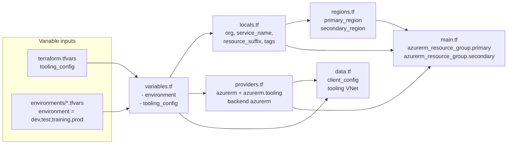
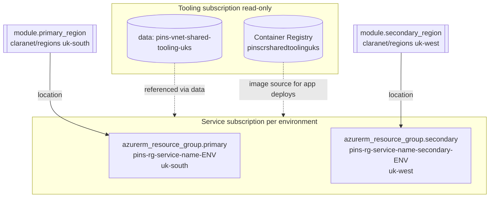
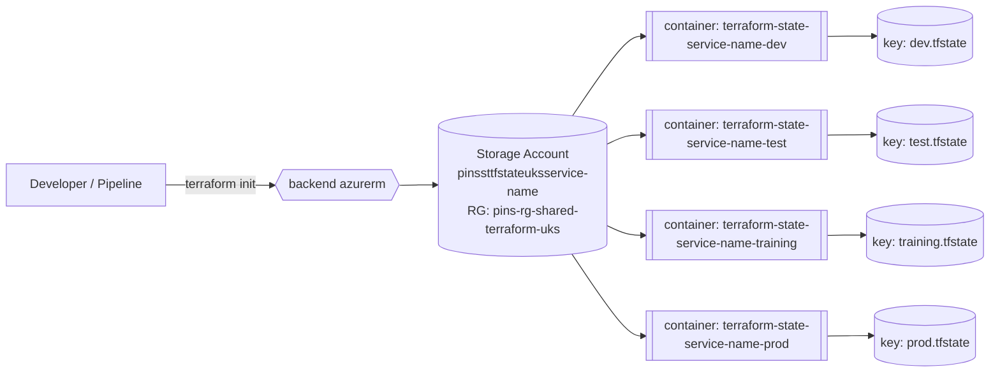
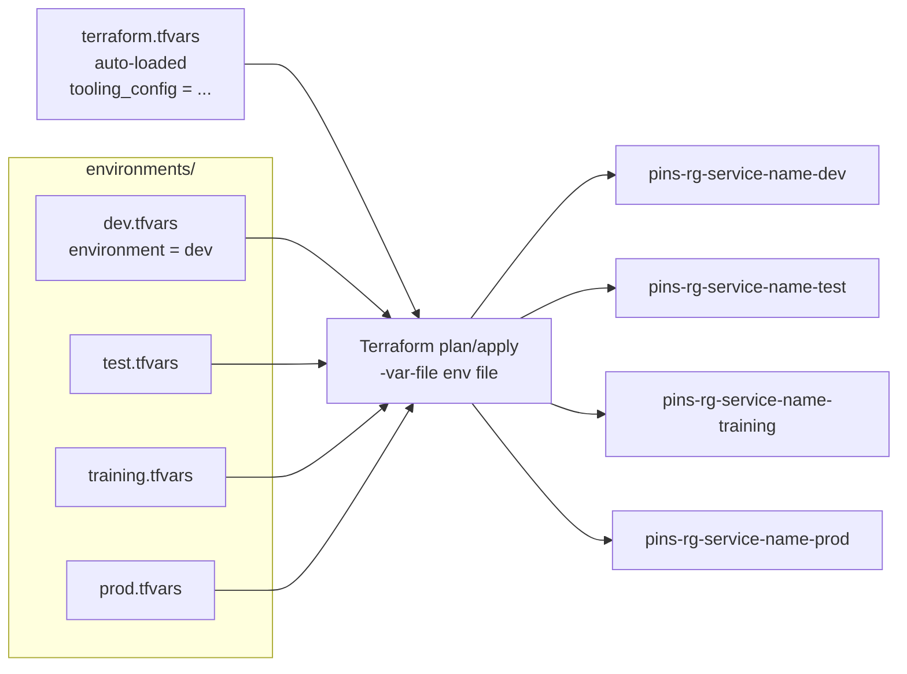
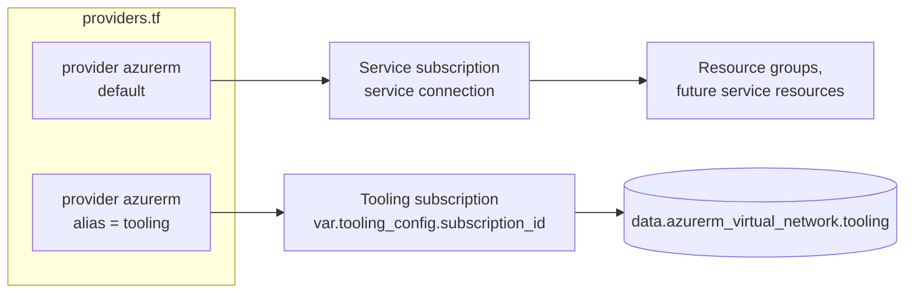
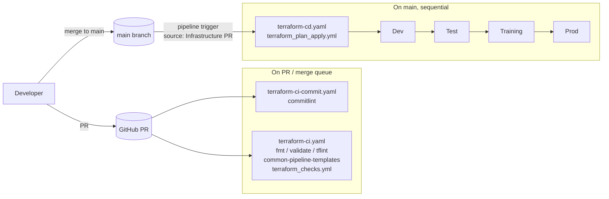
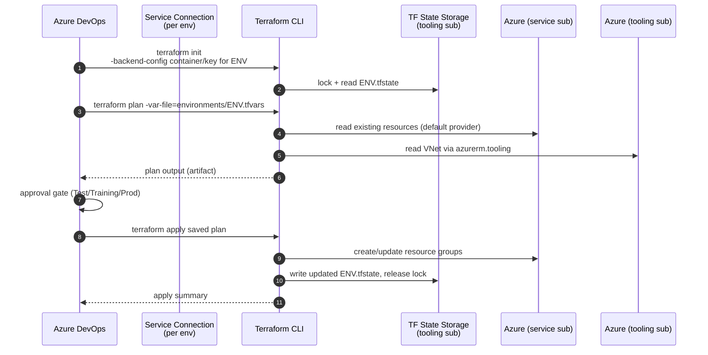
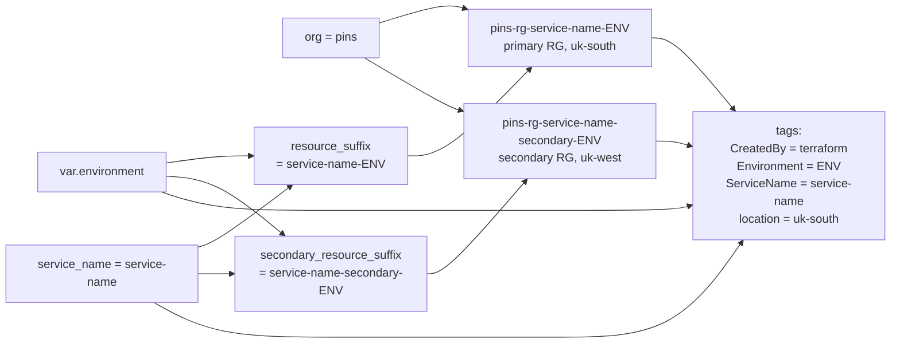

infra

# Infrastructure

This folder contains the infrastructure-as-code (using Terraform) for this project.

## Pipelines

There are two pipelines, one for static checks during PR, and one to plan and apply the infrastructure. These are based on common-pipeline-templates.

## Environments

Differences between environments are managed with simple tfvars files, found in the `environments` folder.

## Common Variables

Variables with common values across environments are set in the `terraform.tfvars` file, which Terraform looks for automatically.

<https://developer.hashicorp.com/terraform/language/values/variables#variable-definitions-tfvars-files>

---

## Diagrams

The following diagrams describe what is currently wired up in this folder. The Terraform here is intentionally minimal — it provisions a primary and secondary resource group ([main.tf](main.tf)), reads a shared tooling VNet via a `data` source ([data.tf](data.tf)), and resolves region metadata via the `claranet/regions/azurerm` module ([regions.tf](regions.tf)). Per-service resources (App Services, SQL, Redis, Key Vault, etc.) are expected to be added on top.

### File / Module Layout

How the `.tf` files in this folder relate to each other and to the inputs Terraform consumes at plan time.

### Resource Graph (what gets created)

What `terraform apply` actually produces today, and what it reads from the tooling subscription.

### State Backend

Terraform state for this folder is stored in a shared storage account in the tooling subscription. The container/key are supplied per environment at `terraform init` time by the CD pipeline.

### Environments & Variable Resolution

How a single Terraform configuration produces four distinct environments.

### Providers

Two `azurerm` providers are configured: a default one targeting the service subscription (taken from the pipeline's service connection) and an aliased one for read-only access to tooling resources.

### Pipelines

The three pipeline definitions in [pipelines/](pipelines/) and how they relate to commits, PRs and environments.

### Plan/Apply Flow per Environment

What happens inside the CD pipeline for a single environment stage.

### Naming Convention

How `locals.tf` composes resource names so every environment is consistent.

